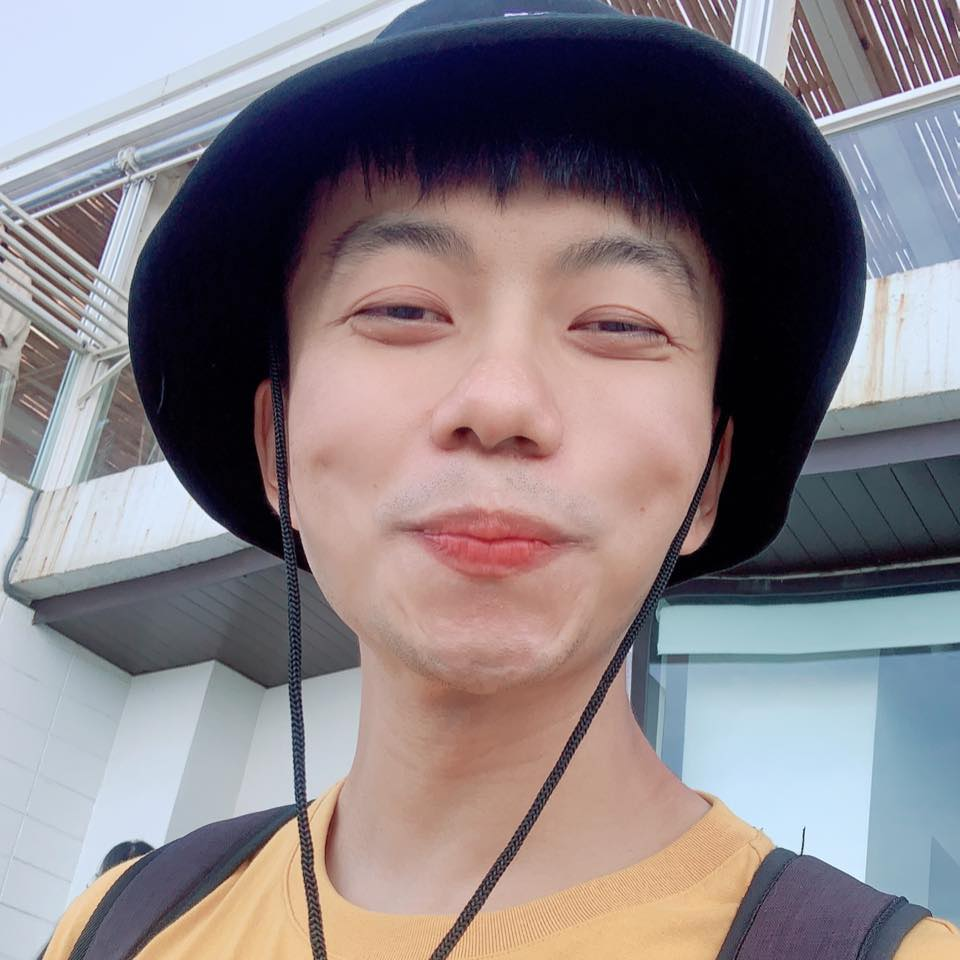

# Jack Yen
## Senior Android Developer

---

# About Me

Senior Android Developer with 9+ years of experience in building scalable mobile applications, SDKs, and embedded systems.

Specialized in:

- Kotlin / Java development
- Android Architecture (MVVM / MVP / MVI)
- Jetpack Compose
- Android SDK Development
- Embedded Systems Integration
- Performance Optimization
- Code Quality Improvement
- Team Collaboration & Technical Leadership

Experienced in leading app development from scratch to production, improving system stability, and driving development efficiency through best practices and AI-assisted development.

---

# Core Skills

## Programming Languages

- Kotlin
- Java

## Android Expertise

- MVVM / MVP / MVI Architecture
- Jetpack Compose
- Android SDK Development
- RESTful API Integration
- Retrofit / OkHttp
- Firebase Crashlytics

## Development Tools

- Android Studio
- Git / Github
- Jira
- AI-assisted Development Tools

## Testing

- Unit Testing
- JUnit
- AndroidJUnit

## Others

- Agile / Scrum
- Design Patterns
- Code Review
- Performance Debugging
- Team Mentoring

---

# Career Timeline

| Company | Position | Period |
|---|---|---|
| Kika Tech | Senior Android Developer | 2025/03 ~ 2026/04 |
| Cloud Interactive | Senior Android Developer | 2022/09 ~ 2024/12 |
| Toppan IDGate | Senior Android Developer | 2021/03 ~ 2022/09 |
| Unitech | Android Developer | 2017/05 ~ 2021/02 |

---

# Kika Tech
## Senior Android Developer
### 2025/03 ~ 2026/04

---

## Responsibilities

Led development and maintenance of Android input method applications across:

- Mobile
- Tablet
- TV Platform

Products include:

- Kika Keyboard
- Kika Keyboard F
- Kika Keyboard 12key

---

## Technical Highlights

### Development

- Java (MVC)
- Kotlin (MVVM)
- Jetpack Compose + Kotlin (MVI)

### Quality Management

- Code Review
- Device Logcat Analysis
- Debugging and Crash Investigation

### Efficiency Improvement

- Improved app stability
- Reduced crash frequency
- Enhanced code reusability across projects

### Innovation

- Used AI-assisted development
- Rapidly prototyped internal tools
- Improved development productivity

---

## Key Projects

### Tablet Keyboard

- TCL Adam
- WF

### Mobile Keyboard

- Hisense Refrigerator
- Jiajingtong A71 / A72

### TV Keyboard

- Hisense
- MI
- Newline

---

# Cloud Interactive
## Senior Android Developer
### 2022/09 ~ 2024/12

---

## Responsibilities

Responsible for developing and maintaining client applications:

- Carrefour
- Taitra
- CEC

Also developed products from scratch and launched successfully to production:

- Richart Life SDK
- Swimple App

---

## Technical Highlights

### Development

- Java + MVP Architecture
- Refactoring to Kotlin + MVVM

### Quality Management

- Development Risk Assessment
- Issue Coordination & Resolution
- Code Review

### Team Contribution

- Recruitment Interview
- Newcomer Guidance
- Project Review
- Best Practice Promotion

---

## Key Projects

### Carrefour App

- New feature development
- Code optimization
- MVP → MVVM migration

### Taitra App

- Maintenance and re-launch

### CEC App

- Bug fixing and issue resolution

### Richart Life EPI SDK

- SDK page and feature development

### Swimple App

Built from scratch with:

- Chatroom
- Calendar
- Notification System
- Maps
- Order Management System

---

# Toppan IDGate
## Senior Android Developer
### 2021/03 ~ 2022/09

---

## Responsibilities

Focused on banking security and identity verification systems.

---

## Major Contributions

### Identity Verification System

- Design and development

### FIDO UAF Android System

- System design
- Full implementation

### Security

- Vulnerability analysis
- Vulnerability fixing

### Testing

- API testing documentation
- Unit test design

### Customization

- Bank login system customization

---

## Delivered Solutions

Successfully delivered authentication systems for:

- CTBC Bank
- E.Sun Bank
- First Bank
- Chang H Bank

---

# Unitech
## Android Developer
### 2017/05 ~ 2021/02

---

## Responsibilities

Embedded Android application development for industrial devices.

---

## Major Contributions

### Embedded App Design

- RFID Integration
- Bluetooth Integration
- NFC Integration
- Firmware Communication

### Automated Testing

- Product testing tools development

### On-site Validation

- Requirement validation
- Product testing
- Client-side support

---

## Key Projects

### ATSAgent

Automated testing system for industrial electronic devices.

### RFID2Key

Scanner-related app with firmware integration.

### USU

Bluetooth + MCU communication system for device control and data transfer.

---

# Highlight Projects

---

# Android IME Compose
## Personal Project
### 2026

---

## Project Goal

Designed and implemented a Jetpack Compose-based IME prototype from scratch.

---

## Key Achievements

- Rebuilt traditional IME architecture using Compose UI
- Created modular architecture
- Completed input flow and UI interaction
- Verified Compose feasibility in IME field
- Deepened IME architecture understanding

GitHub:

https://github.com/juacie/android_ime_compose

---

# Swimple App
## 2024

---

## Built From Scratch

Features include:

- Login System
- Custom UI Components
- Calendar
- Chat System
- Notification System
- User Switching
- Flutter Integration
- Sendbird Integration

Google Play:

https://play.google.com/store/apps/details?id=com.swimple.life.apps

---

# Education

## National Taiwan University of Science and Technology

### Bachelor of Computer Science

Sep. 2013 – Jun. 2017

Taipei, Taiwan

---

# Why Me

## What I Bring

- 9+ years Android experience
- Strong architecture thinking
- Product ownership mindset
- Stability and performance focus
- Team leadership capability
- Fast adaptation to new technology
- Strong problem-solving ability

I build products that are stable, scalable, and production-ready.

---

# Thank You

## Jack Yen

Senior Android Developer

Let’s build great products together.
